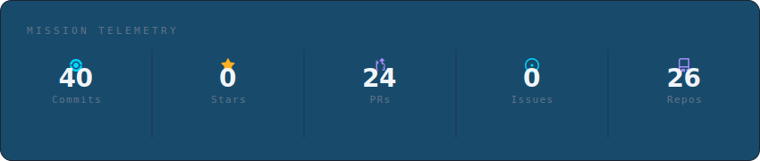

<!-- Galaxy Profile README Template
     Customize this file with your own info, then rename it to README.md
     in your GitHub profile repo (github.com/YOUR_USERNAME/YOUR_USERNAME).
     The SVG paths below point to assets/generated/ which are auto-generated
     by the GitHub Actions workflow or by running: python -m generator.main -->

  

 

  

 

  

 

  

 

<strong>Saiba mais sobre mim</strong>

 

Desenvolvedor Full-Stack & Analista de Dados com foco em eficiência operacional e escalabilidade. Experiência sólida na criação de aplicações Web/Mobile (Django, React Native) e pipelines de dados (Python, GCP, Power BI). Busco aplicar minha capacidade analítica e de desenvolvimento para otimizar processos e gerar valor através de software de alta performance.

**Currently at** Pernambuco, Brazil

 

  
  

